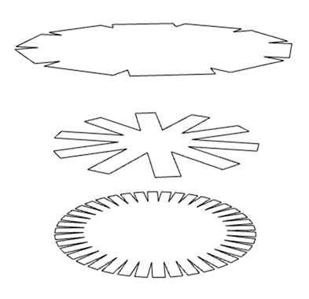

# geo-asterisk


[](http://github.com/badges/stability-badges)

Creates a 2d asterisk type shape in 3d space.

## Usage

[](https://www.npmjs.com/package/geo-asterisk)

### Example

An example can be found at `./test/index.js`. You can run this test by calling:
```
$ npm test
```

A simple usage example with default values being passed as settings:
```javascript
var geoAsterisk = require('geo-asterisk');

// geo will be a Object will two properties:
// positions - the vertices
// cells - the indices to draw the asterisk
var geo = geoAsterisk( {
    cellSize: 3, // 1 == points, 2 == lines, 3 == triangles
    x: 0, // x position of the center of the asterisk
    y: 0, // y position of the center of the asterisk
    z: 0, // z position of the center of the asterisk
    startRadian: 0, // this will rotate the asterisk
    innerRadius: 50, // inner radius of the asterisk
    outerRadius: 140, // the outer radius for the asterisk
    numSlices: 10 // how many "points" there will be on the asterisk
});
```

## License

MIT, see [LICENSE.md](http://github.com/mikkoh/geo-asterisk/blob/master/LICENSE.md) for details.
